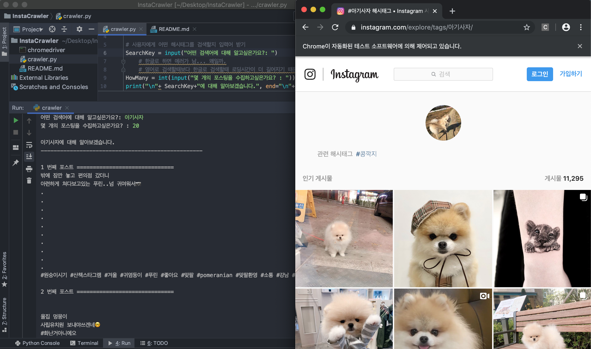
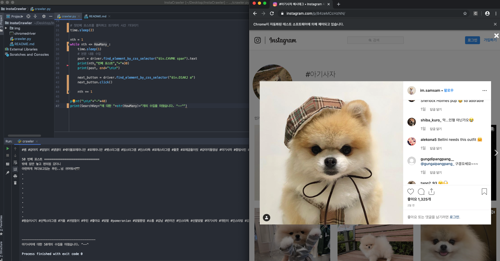

# Instagram Crawler
crawler.py를 실행시키기 전에 같은 로컬의 폴더에 자신의 chrome버전과 맞는 `chromedriver`를 다운받아야 한다. 

- 여기서 [다운로드](http://chromedriver.chromium.org/downloads)

### screenshot

### Issue
1.
    - URL을 통한 태그 검색을 할때, SearchKey(검색어)가 영어일때보다 한글일때 로딩되는 시간이 더 길다.
    - 또, 수집하는 포스팅의 갯수가 많을수록 기다리는 시간을 조금 늘려야 한다.
    > 따라서 `time.sleep()`함수를 통해 기다리는 시간을 늘려야 한다. 
  
                                                                                                                                                                                                                          
1. 
    - 사용자로부터 몇개의 포스팅을 크롤링할지를 HowMany변수를 input()을 통해 받았다. 그런데 컴퓨터 환경에 따라서 21개 혹은 33개의 컨테이너만이 수집되는 문제가 있었다. 
    - 이는 페이지에 처음 접속했을때 바로 수집할 수 있는 컨테이너의 양이 네트워크 속도와 연관됐기 때문 아닐까 예상. 
        - 같은 코드인데도 학교 WIFI에서는 21개의 컨테이너 수집이 최대였고, 집의 (SKT)WIFI에서는 33개의 컨테이너가 최대인 것을 확인. 또 컴퓨터마다 수집되는 컨테이너의 최대 개수가 달라짐도 확인하였다.  
        - 그래서 곳곳에 time.sleep()함수를 통해 지연시간을 늘려보고자 하였지만 해결이 되지 않았음. 
    - 그래서 컨테이너 수집이 아닌 다른 방법을 모색하고자 함.  
    > 컨테이너 수집이 아니라 첫번째 포스터에서 다음 포스터로 넘어가기 위한 `next_button`변수를 만들어 다음 포스터로 넘어가는 버튼을 클릭하게끔 하였다. 이를 while문을 사용하여 크롤링하고싶은 포스팅의 갯수만큼 구문이 반복되도록 하였다. 

